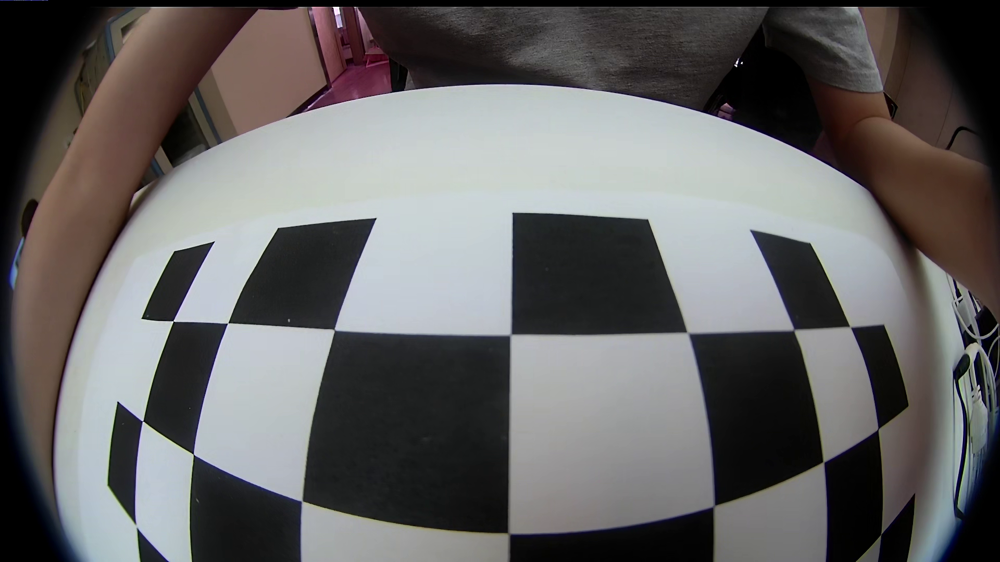
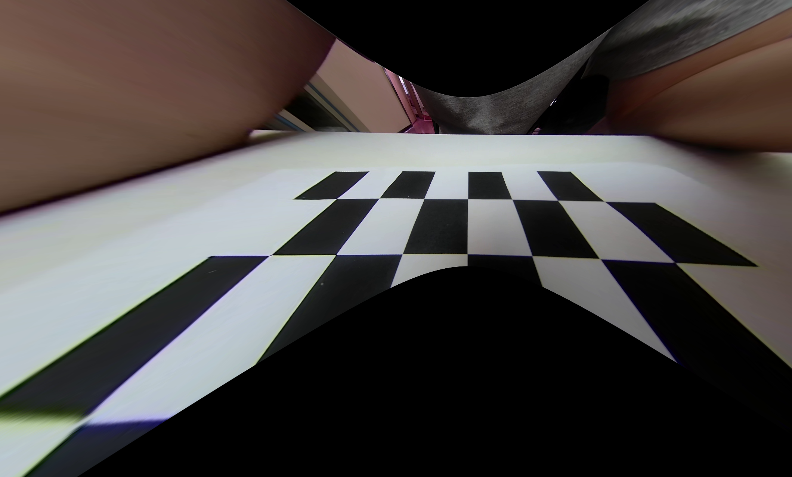
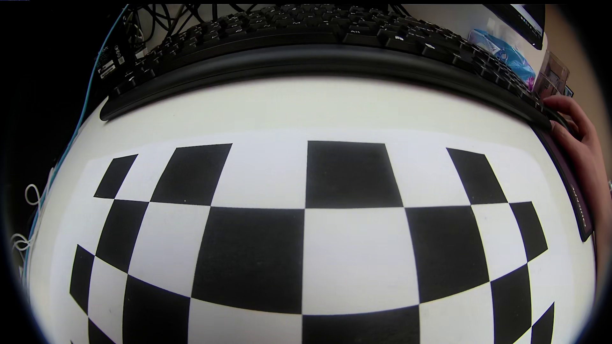
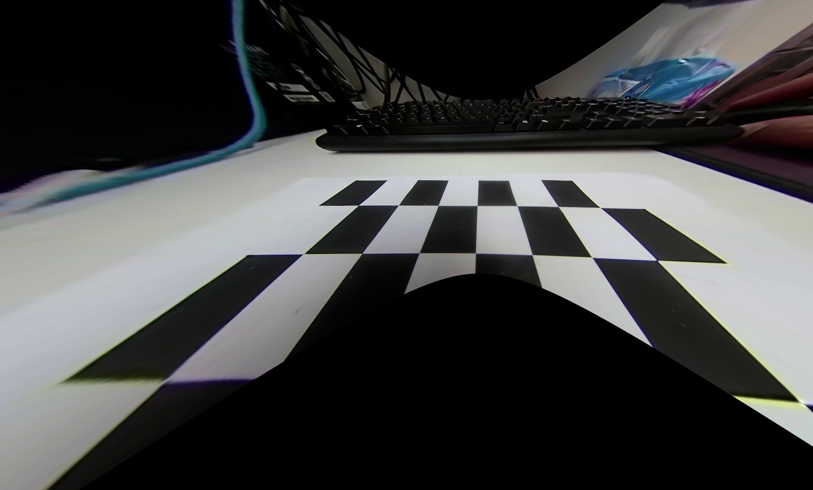
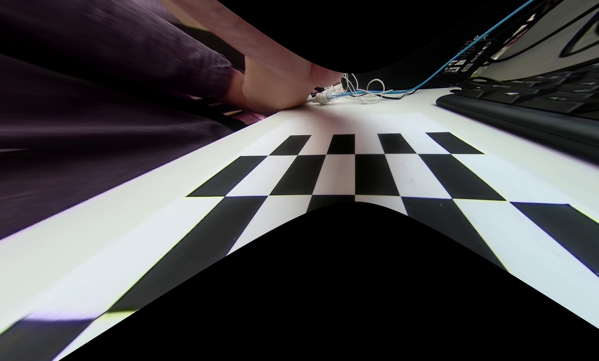
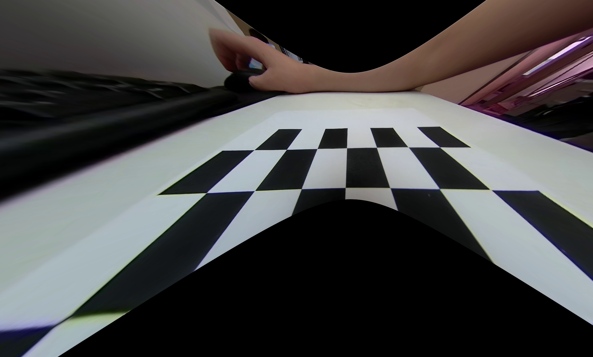
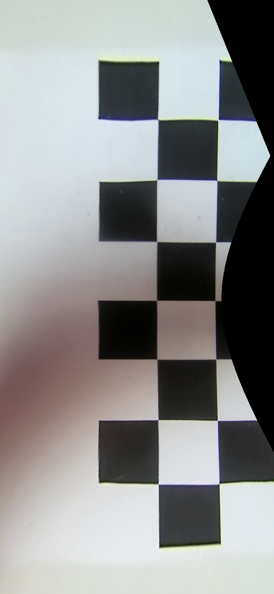
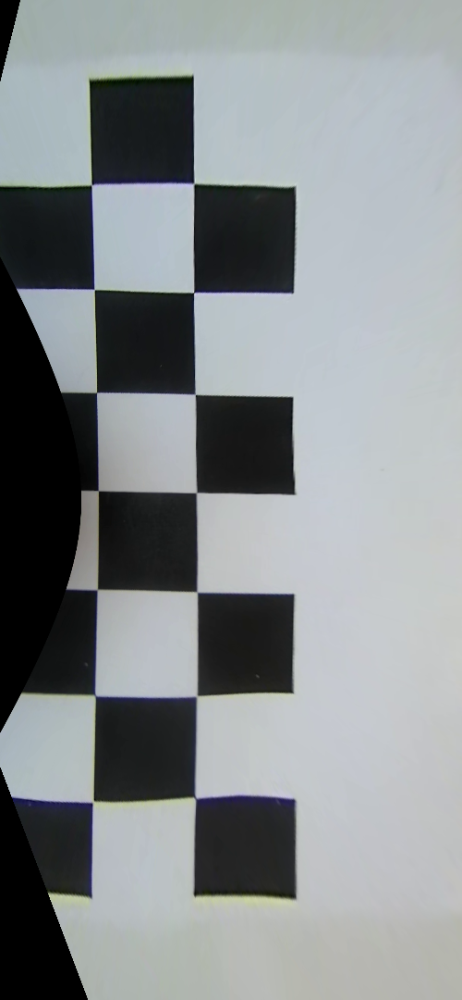

# SurroundViewSystem_Demo

It is a surround view system based on fisheye camera.

1. calibration and undistort

   | before                                 | after                                  |
   | -------------------------------------- | -------------------------------------- |
   |  |  |
   |  |  |
   |  |  |
   |  |  |

2. perspective transform
|left|right|
|-|-|
|||

|front|back|
|-|-|
|||

3. stitching

